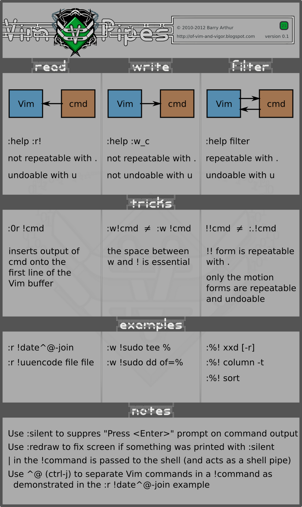

# .vim

My Vim configuration.

## Resources

- [Five Minute Vimscript](http://andrewscala.com/vimscript/)
- [Extra vim-plug stuff](https://github.com/junegunn/vim-plug/wiki/extra)

## netrw

h: netrw provides 'ssh hints':

```vimdoc
Thomer Gil has provided a hint on how to speed up netrw+ssh:
http://thomer.com/howtos/netrw_ssh.html

Alex Young has several hints on speeding ssh up:
http://usevim.com/2012/03/16/editing-remote-files/
```

Both pages are offline...

- <https://web.archive.org/web/20120319233142/https://www.usevim.com/2012/03/16/editing-remote-files/>

- <https://web.archive.org/web/20120319233142/https://www.usevim.com/2012/03/16/editing-remote-files/#expand>
<!-- TODO: add image sources -->

Luckily they have been cached by the Internet Archive.

## Cheatsheet


## Pipes



## Spell Checking

Download [cspell](http://streetsidesoftware.github.io/cspell/)
dictionaries from [cspell-dicts](https://github.com/streetsidesoftware/cspell-dicts/tree/main/dictionaries)

## References

- [Learn Vimscript the Hard Way](https://learnvimscriptthehardway.stevelosh.com/)
- Google's Vimscript Style Guide:
  - [Vimscript Style Guide](https://google.github.io/styleguide/vimscriptguide.xml)
  - [Vimscript Full Style Guide](https://google.github.io/styleguide/vimscriptfull.xml)
- [No Plugins](https://github.com/changemewtf/no_plugins)
- [Idiomatic Vimrc](https://github.com/romainl/idiomatic-vimrcr)
- [Five Minute Vimscript](http://andrewscala.com/vimscript/)

---

> Any sufficiently complicated set of Vim plugins contains an ad hoc, informally-
> specified, bug-ridden, slow implementation of half of Vim's features.
>
> _robertmeta's tenth rule_
